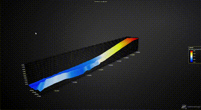
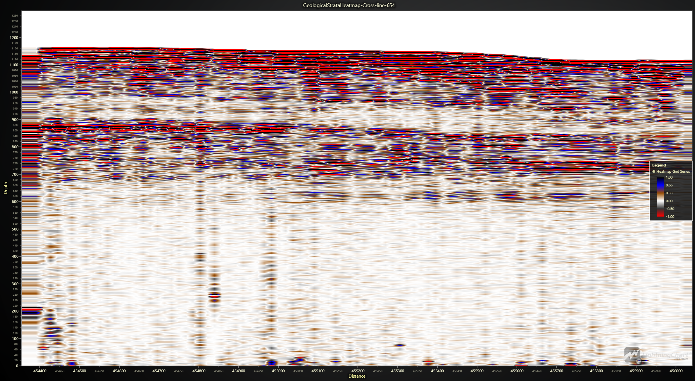

I apologize for the oversight. Below is the complete README file, including scripts and images:

---

# Python Dashboard for Marine Seismic Data Interpretation

## Overview

This project demonstrates the use of Python and LightningChart for visualizing marine seismic data. The focus is on creating a dashboard that effectively interprets and visualizes 3D seismic data to aid in the exploration and research of subsurface geological formations. The dataset used for this project is from the Blake Ridge Hydrates 3D project, located offshore of South Carolina, USA.

## Introduction

### What is Marine Seismic Data?

Marine seismic data involves collecting sound waves that are sent through the Earth's subsurface and reflected back to sensors on the water's surface. This data is crucial for exploring underwater geological formations, including the search for oil and gas reserves and understanding geological features such as methane hydrates and fault lines.

### The Role of Marine Seismic Data in Exploration and Research

Marine seismic data plays an essential role in identifying potential drilling sites and understanding geological processes under the sea floor, which is critical for studying natural hazards and environmental monitoring.

### Key Concepts in Marine Seismic Data Interpretation

- **Seismic Reflection**: Analyzing reflected sound waves to interpret subsurface structures.
- **3D Seismic Data**: Provides a three-dimensional view of the subsurface, enhancing geological interpretations.
- **Seismic Attributes**: Quantitative measures derived from seismic data used to understand subsurface features.

## Dataset

The dataset used in this project is from the Blake Ridge Hydrates 3D project, located offshore of South Carolina, USA. Acquired using a single 4-km-long streamer and a small array of two 105/105 cu. in. GI guns, the dataset includes detailed 3D seismic images capturing the subsurface geological features, particularly a significant methane hydrate system.

### Key Details:

- **Country**: USA
- **Location**: Offshore, South Carolina
- **Acquisition**: 2000
- **Data Summary**: 1.94 GB (uncompressed), 914 MB (download)
- **License**: Creative Commons 3.0

## Visualization

### Tools and Libraries

- **Python**: Programming language used for data processing and visualization.
- **NumPy**: For numerical computations.
- **Pandas**: For data manipulation and analysis.
- **SciPy**: For advanced mathematical and scientific computations.
- **LightningChart**: For creating high-performance data visualizations.

### Setting Up the Environment

1. Install Python and the necessary libraries.
2. Set up a virtual environment to manage project dependencies.
3. Use Visual Studio Code (VSCode) for development.

### Loading and Processing Data

1. Load the data files using Pandas.
2. Handle and preprocess the data for visualization.

### Creating Visualizations

#### 3D Surface Plot for Seabed Coordinates

This plot represents the seabed coordinates, showcasing variations in depth and highlighting the geological structure of the seabed.

**Script:**

```python
import lightningchart as lc
import numpy as np
import pandas as pd
from scipy.interpolate import griddata

# Read the license key from a file
lc.set_license('my-license-key')

# Load and preprocess data
file_path = 'path_to_your_file.xlsx'
df = pd.read_excel(file_path)
X, Y, Z = df['X'].values, df['Y'].values, df['Z'].values
grid_x, grid_y = np.meshgrid(np.linspace(X.min(), X.max(), 100), np.linspace(Y.min(), Y.max(), 100))
grid_z = griddata((X, Y), Z, (grid_x, grid_y), method='linear')
grid_z = np.where(np.isnan(grid_z), griddata((X, Y), Z, (grid_x, grid_y), method='nearest'), grid_z)

# Create 3D chart
chart = lc.Chart3D(theme=lc.Themes.Dark, title='Seabed Coordinates')
series = chart.add_surface_grid_series(columns=grid_x.shape[1], rows=grid_y.shape[0])
series.set_start(x=grid_x.min(), z=grid_y.min()).set_end(x=grid_x.max(), z=grid_y.max())
series.invalidate_height_map(grid_z.tolist())
series.invalidate_intensity_values(grid_z.tolist())
series.set_palette_colors(steps=[{'value': np.min(grid_z), 'color': lc.Color(0, 0, 255)},
                                 {'value': np.percentile(grid_z, 25), 'color': lc.Color(0, 128, 255)},
                                 {'value': np.percentile(grid_z, 50), 'color': lc.Color(255, 255, 255)},
                                 {'value': np.percentile(grid_z, 75), 'color': lc.Color(255, 255, 0)},
                                 {'value': np.max(grid_z), 'color': lc.Color(255, 0, 0)}], look_up_property='value', percentage_values=False)
chart.add_legend(data=series)
chart.open()
```




#### GeologicalStrataHeatmap-Z-slice-4700

This heatmap shows the intensity of seismic reflections at a particular depth (Z-slice), providing insights into the subsurface geological structures.

**Script:**

```python
import lightningchart as lc
import pandas as pd
import numpy as np
from scipy.interpolate import griddata

# Read the license key from a file
with open('path/to/shared_variable.txt', 'r') as f:
    mylicensekey = f.read().strip()
lc.set_license(mylicensekey)

# Load the data
file_path = 'path/to/Z-slice-4700.csv'
data = pd.read_csv(file_path, header=None)

# Split the data into columns based on the expected format
data.columns = ['X', 'Y', 'Z']

# Extract X, Y, Z values
X = data['X'].values
Y = data['Y'].values
Z = data['Z'].values

# Create a grid of points
grid_x, grid_y = np.meshgrid(
    np.linspace(X.min(), X.max(), 500),  # Increase resolution for better clarity
    np.linspace(Y.min(), Y.max(), 500)
)

# Interpolate Z values on the grid using linear interpolation
grid_z = griddata((X, Y), Z, (grid_x, grid_y), method='linear')

# Fill any remaining NaN values with nearest method
grid_z = np.where(np.isnan(grid_z), griddata((X, Y), Z, (grid_x, grid_y), method='nearest'), grid_z)

# Create a chart
chart = lc.ChartXY(theme=lc.Themes.Dark, title='GeologicalStrataHeatmap-Z-slice-4700')

# Add a Heatmap Grid Series
heatmap = chart.add_heatmap_grid_series(
    columns=grid_x.shape[1],
    rows=grid_y.shape[0]
)

# Set the start and end coordinates for the heatmap
heatmap.set_start(x=0, y=0)  # Start at 0 for both axes
heatmap.set_end(x=1300, y=100)  # Set end to 1300 for x-axis and 100 for y-axis

# Set the intensity values
heatmap.invalidate_intensity_values(grid_z)

# Define custom palette to better match the expected result
custom_palette = [
    {"value": -1.0, "color": lc.Color(255, 0, 0)},     # Black  
    {"value": -0.5, "color": lc.Color(50, 50, 50)},  # Dark Gray   
    {"value": 0, "color": lc.Color(255, 255, 255)},  # White  
    {"value": 0.33, "color": lc.Color(150, 75, 0)},  # Brown
    {"value": 0.66, "color": lc.Color(0, 0, 255)},   # Blue   
    {"value": 1.0, "color": lc.Color(0, 0, 0)},    # Red    
]

heatmap.set_palette_colors(
    steps=custom_palette,
    look_up_property='value',
    interpolate=True
)

# Customize axes
chart.get_default_x_axis().set_title('X')
chart.get_default_y_axis().set_title('Y')
chart.add_legend(data=heatmap)
chart.open()
```


#### GeologicalStrataHeatmap-In-line47

This heatmap displays a vertical slice along the inline direction (line 47) of the seismic data, highlighting the geological features and stratification in the subsurface.

**Script:**

```python
import lightningchart as lc
import numpy as np
import pandas as pd
from scipy.interpolate import griddata

# Read the license key from a file
lc.set_license('my-license-key')

# Load and preprocess data
file_path = 'in-line-47.csv'
data = pd.read_csv(file_path, header=None)

data = pd.read_csv(file_path, header=None)
data.columns = ['X', 'Y', 'Z']
X, Y, Z = data['X'].values, data['Y'].values, data['Z'].values
grid_x, grid_y = np.meshgrid(np.linspace(X.min(), X.max(), 500), np.linspace(Y.min(), Y.max(), 500))
grid_z = griddata((X, Y), Z, (grid_x, grid_y), method='linear')
grid_z = np.where(np.isnan(grid_z), griddata((X, Y), Z, (grid_x, grid_y), method='nearest'), grid_z)

# Create heatmap
chart = lc.ChartXY(theme=lc.Themes.Dark, title='GeologicalStrataHeatmap-In-line47')
heatmap = chart.add_heatmap_grid_series(columns=grid_x.shape[1], rows=grid_y.shape[0])
heatmap.set_start(x=0, y=0).set_end(x=1300, y=100)
heatmap.invalidate_intensity_values(grid_z)
heatmap.set_palette_colors(steps=[{"value": -1.0, "color": lc.Color(255, 0, 0)},
                                  {"value": -0.5, "color": lc.Color(50, 50, 50)},
                                  {"value": 0, "color": lc.Color(255, 255, 255)},
                                  {"value": 0.33, "color": lc.Color(150, 75, 0)},
                                  {"value": 0.66, "color": lc.Color(0, 0, 255)},
                                  {"value": 1.0, "color": lc.Color(0, 0, 0)}], look_up_property='value', interpolate=True)
chart.get_default_x_axis().set_title('X')
chart.get_default_y_axis().set_title('Y')
chart.add_legend(data=heatmap)
chart.open()
```


#### GeologicalStrataHeatmap-Cross-line-654

This heatmap displays a vertical slice along the crossline direction (line 654) of the seismic data, showing detailed subsurface geological formations and stratification.

**Script:**

```python
import lightningchart as lc
import pandas as pd
import numpy as np
from scipy.interpolate import griddata

# Read the license key from a file
lc.set_license('my-license-key')

# Load and preprocess data
file_path = 'Cross-line-654.csv'
data = pd.read_csv(file_path, header=None)
data.columns = ['X', 'Y', 'Z']
X, Y, Z = data['X'].values, data['Y'].values, data['Z'].values
grid_x, grid_y = np.meshgrid(np.linspace(X.min(), X.max(), 500), np.linspace(Y.min(), Y.max(), 500))
grid_z = griddata((X, Y), Z, (grid_x, grid_y), method='linear')
grid_z = np.where(np.isnan(grid_z), griddata((X, Y), Z, (grid_x, grid_y), method='nearest'), grid_z)

# Create heatmap
chart = lc.ChartXY(theme=lc.Themes.Dark, title='GeologicalStrataHeatmap-Cross-line-654')
heatmap = chart.add_heatmap_grid_series(columns=grid_x.shape[1], rows=grid_y.shape[0])
heatmap.set_start(x=0, y=0).set_end(x=1300, y=100)
heatmap.invalidate_intensity_values(grid_z)
heatmap.set_palette_colors(steps=[{"value": -1.0, "color": lc.Color(255, 0, 0)},
                                  {"value": -0.5, "color": lc.Color(50, 50, 50)},
                                  {"value": 0, "color": lc.Color(255, 255, 255)},
                                  {"value": 0.33, "color": lc.Color(150, 75, 0)},
                                  {"value": 0.66, "color": lc.Color(0, 0, 255)},
                                  {"value": 1.0, "color": lc.Color(0, 0, 0)}], look_up_property='value', interpolate=True)
chart.get_default_x_axis().set_title('X')
chart.get_default_y_axis().set_title('Y')
chart.add_legend(data=heatmap)
chart.open()
```



## Conclusion

The use of Python and LightningChart for marine seismic data interpretation offers a comprehensive and high-performance approach to visualizing complex geological datasets. Throughout this project, we have demonstrated how to leverage the powerful capabilities of LightningChart to create detailed and interactive visualizations, aiding in the exploration and analysis of subsurface structures.
The project centered around visualizing seismic data from the Blake Ridge Hydrates 3D project, a well-known methane hydrate system located offshore of South Carolina, USA. This dataset provides a rich source of information for understanding the subsurface geology, particularly the presence of methane hydrates and their interaction with other geological features.
By using LightningChart, we created several key visualizations:
1.	3D Surface Plot for Seabed Coordinates: This plot effectively visualizes the seabed's topography, highlighting variations in depth and geological features on the seabed.
2.	Heatmaps for Geological Strata: These heatmaps offer cross-sectional views of the subsurface at different orientations (Z-slice, inline, and cross-line). They provide detailed insights into the internal structure and layering of the geological strata, helping to identify features like faults, folds, and stratigraphic variations.
These visualizations not only enhance our understanding of the subsurface but also facilitate better decision-making in exploration and research. The ability to interact with the visualizations and customize them according to specific needs adds significant value to the analysis process.


## Benefits of Using LightningChart Python for Visualizing Data

high Performance
One of the standout features of LightningChart is its ability to handle large datasets with exceptional performance. Marine seismic data typically involves extensive datasets with high-resolution measurements, making it crucial to use a tool that can render these data points smoothly and quickly. LightningChart excels in this area, ensuring that users can interact with complex visualizations without experiencing lag or performance issues. This high performance is essential for real-time data analysis and interpretation, where quick insights can lead to more informed decisions.
Versatility
LightningChart supports a wide range of chart types, from basic line and bar charts to advanced 3D surface plots and heatmaps. This versatility allows users to create various visualizations tailored to different aspects of seismic data analysis. For example, 3D surface plots are ideal for visualizing seabed topography, while heatmaps are perfect for depicting the intensity of seismic reflections across different geological strata. The ability to switch between different visualization types and customize them extensively means that researchers can explore the data from multiple angles and gain a more comprehensive understanding of the subsurface structures.
Ease of Use
Despite its advanced capabilities, LightningChart is designed to be user-friendly, with an intuitive API that simplifies the process of creating and customizing charts. This ease of use is particularly beneficial for researchers and engineers who may not have extensive programming experience. By reducing the complexity of visualization coding, LightningChart allows users to focus more on data analysis and interpretation rather than getting bogged down in technical details. The straightforward methods for adding data points, customizing axes, and applying color palettes make it easy to create professional-grade visualizations in a short amount of time.
Interactive and Customizable Visualizations
LightningChart provides interactive features that enhance the user experience. Users can zoom, pan, and rotate the visualizations to examine specific areas in greater detail. This interactivity is crucial for seismic data interpretation, where subtle details can provide significant insights into the subsurface geology. Additionally, LightningChart offers extensive customization options, allowing users to adjust the appearance of the charts to highlight specific features or match publication standards. Customizable color palettes, legends, and axis titles ensure that the visualizations are not only informative but also visually appealing.(LightningChart® Python Charts for Data Visualization, 2024)


## References

- Holbrook, W. S., et al. (2002). "Seismic detection of marine methane hydrate," The Leading Edge, 21, 686-689.
- Hornbach, M. J., et al. (2003). "Direct seismic detection of methane hydrate on the Blake Ridge," Geophysics, 
